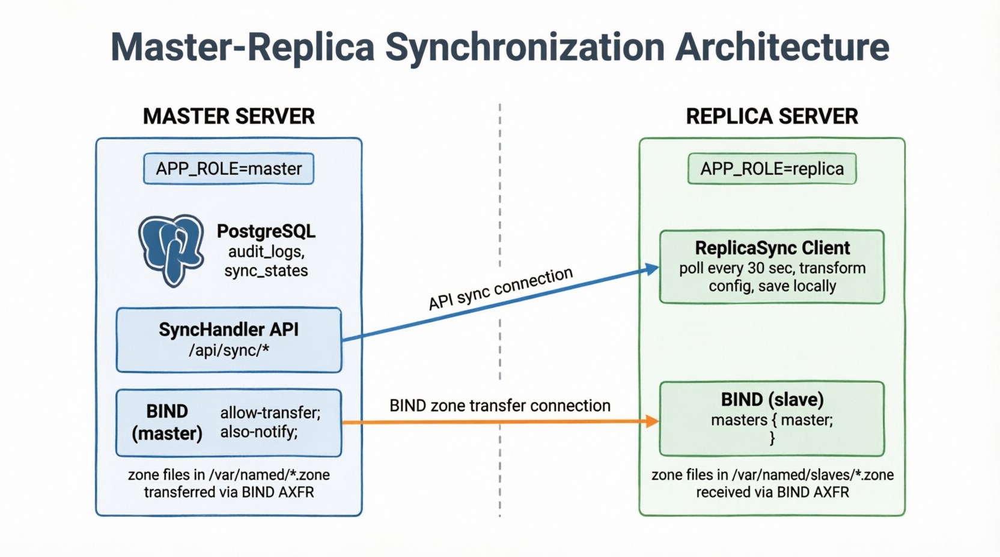
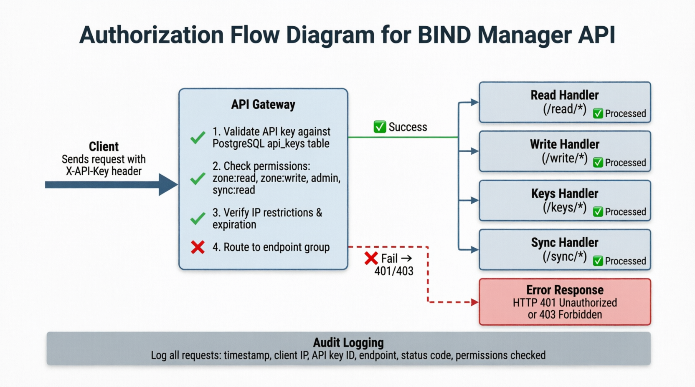
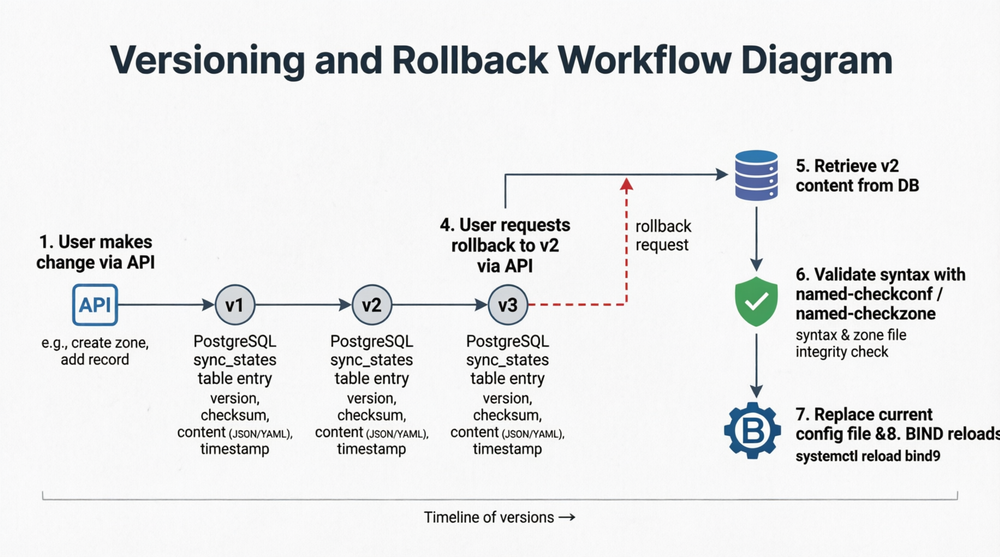

# 📘 BIND API

**Репозиторий:** [github.com/mooncfrat2019/bind-api](https://github.com/mooncfrat2019/bind-api)  
**Версия:** 0.4.0  
**Последнее обновление:** Май 2026

---

## 📋 Содержание

1. [Обзор](#1-обзор)
2. [Архитектура](#2-архитектура)
3. [Быстрый старт](#3-быстрый-старт)
4. [Конфигурация](#4-конфигурация)
5. [API Reference](#5-api-reference)
6. [Авторизация и безопасность](#6-авторизация-и-безопасность)
7. [Версионирование и откат](#7-версионирование-и-откат)
8. [Master-Replica синхронизация](#8-master-replica-синхронизация)
9. [Автоматическая проверка A-записей](#9-автоматическая-проверка-a-записей)
10. [Мониторинг и отладка](#10-мониторинг-и-отладка)
11. [Troubleshooting](#11-troubleshooting)

---

## 1. Обзор

**BIND Manager API** — это REST API сервис для управления DNS-сервером BIND (named) с поддержкой Master-Replica архитектуры, версионирования конфигурации, автоматической синхронизации и гибкой системы авторизации.

### Возможности

| Функция | Описание |
|---------|----------|
| Управление зонами | Создание, удаление, просмотр DNS-зон |
| Управление записями | Добавление/удаление A, AAAA, CNAME, MX, TXT, NS записей |
| Reverse DNS | Автоматическое создание PTR записей |
| Очередь заданий | Последовательная обработка для защиты от race conditions |
| Аудит операций | Полное логирование всех изменений в PostgreSQL |
| Валидация | Проверка синтаксиса перед применением |
| Serial management | Автоматическое увеличение Serial при изменениях |
| Версионирование | Сохранение всех версий конфигов с возможностью отката |
| Master-Replica | Автоматическая синхронизация конфигурации между серверами |
| Трансформация конфигов | Автоматическая конвертация master→slave при синхронизации |
| **Автопроверка A-записей (v0.4.0)** | Реплика автоматически проверяет резолвинг и вызывает retransfer |
| API-ключи | Гибкая система авторизации с правами доступа |

### Технологии

| Компонент | Технология |
|-----------|------------|
| Язык | Go 1.21+ |
| Web Framework | Gin |
| ORM | GORM |
| База данных | PostgreSQL 13+ |
| DNS Server | BIND 9.11+ |
| ОС | РедОС 7.3 / CentOS 7+ |

### Структура проекта

```
bind-api/
├── main.go                 # Точка входа, инициализация Gin-роутера
├── go.mod / go.sum         # Зависимости
├── README.md               # Документация
├── .env.example            # Пример конфигурации
└── internal/
    ├── vars.go             # Глобальные переменные
    ├── consts.go           # Константы
    ├── types.go            # Модели данных
    ├── handlers.go         # HTTP-хендлеры
    ├── methods.go          # Бизнес-логика и middleware
    └── utils.go            # Вспомогательные функции
```

---

## 2. Архитектура

### 2.1. Общая схема


**Поток выполнения запроса:**

1. HTTP Request → Handler
2. Handler → Создаёт Job → Отправляет в channel
3. Handler → Ждёт ответа в ResponseCh (таймаут 30 сек)
4. Worker → Читает из channel → Выполняет операцию
5. Worker → Пишет аудит в PostgreSQL
6. Worker → Сохраняет версию конфига (если изменился)
7. Worker → Возвращает результат в ResponseCh
8. Handler → Возвращает ответ клиенту
9. (MASTER) → Обновляет sync_states для реплик
10. (REPLICA) → Периодически опрашивает /api/sync/state
11. (REPLICA) → Скачивает изменённые конфиги → трансформирует → сохраняет
12. (REPLICA) → Проверяет резолвинг A-записей
13. (REPLICA) → При необходимости выполняет rndc retransfer
14. (REPLICA) → Перезагружает BIND при изменениях

### 2.2. Master-Replica синхронизация



**Принцип работы:**

| Компонент | Мастер | Реплика |
|-----------|--------|---------|
| Конфигурация | Создаёт/изменяет | Получает через API |
| Файлы зон | Создаёт/изменяет | Получает через BIND AXFR |
| База данных | Хранит версии и аудит | Опционально |
| Трансформация | Отдаёт "сырой" конфиг | Применяет трансформации |
| **Проверка A-записей (v0.4.0)** | — | Проверяет резолвинг через nslookup |

### 2.3. Авторизация



**Уровни доступа:**

| Роль / механизм | Назначение | Эндпоинты |
|-----------------|------------|-----------|
| `zone:read` | Чтение зон, аудита и конфигурации | `/read/*` |
| `zone:write` | Изменение зон и записей | `/write/*` |
| `admin` | Управление API-ключами | `/keys/*` |
| `*` | Полный доступ | Все API-эндпоинты |
| `X-Sync-Token` | Синхронизация master-replica | `/sync/*` |
---

## 3. Быстрый старт

### 3.1. Требования

- Go 1.21+
- PostgreSQL 13+
- BIND 9.11+
- Root-доступ к серверу

### 3.2. Установка

```bash
# Клонирование репозитория
git clone https://github.com/mooncfrat2019/bind-api.git
cd bind-api

# Установка зависимостей
go mod tidy

# Сборка
CGO_ENABLED=1 go build -o bind-api main.go
```

### 3.3. Настройка PostgreSQL

```bash
sudo -u postgres psql

CREATE USER dns WITH PASSWORD 'your_secure_password';
CREATE DATABASE dns OWNER dns;

\c dns
CREATE SCHEMA IF NOT EXISTS bind_api;
GRANT ALL PRIVILEGES ON SCHEMA bind_api TO dns;
GRANT ALL PRIVILEGES ON ALL TABLES IN SCHEMA bind_api TO dns;
GRANT ALL PRIVILEGES ON ALL SEQUENCES IN SCHEMA bind_api TO dns;
ALTER DEFAULT PRIVILEGES IN SCHEMA bind_api GRANT ALL ON TABLES TO dns;
ALTER DEFAULT PRIVILEGES IN SCHEMA bind_api GRANT ALL ON SEQUENCES TO dns;

\q
```

### 3.4. Настройка BIND на мастере

```bash
# Добавить include в named.conf
echo 'include "/etc/named.zones.conf";' | sudo tee -a /etc/named.conf

# Создать файл для зон
sudo touch /etc/named.zones.conf
sudo chown root:named /etc/named.zones.conf
sudo chmod 640 /etc/named.zones.conf

# Настроить allow-transfer для реплик
sudo nano /etc/named.conf
# Добавить в options:
# allow-transfer { 10.69.13.4; localhost; };
# also-notify { 10.69.13.4; };

# Проверить rndc
sudo rndc-confgen -a -c /etc/rndc.key
sudo chown named:named /etc/rndc.key
sudo chmod 640 /etc/rndc.key

# Перезапустить BIND
sudo systemctl restart named
```

### 3.5. Запуск MASTER

```bash
# .env для MASTER
APP_ROLE=master
BIND_ZONE_DIR=/var/named/
BIND_NAMED_CONF=/etc/named.conf
BIND_ZONE_CONF=/etc/named.zones.conf
BIND_API_DB_HOST=localhost
BIND_API_DB_PORT=5432
BIND_API_DB_USER=dns
BIND_API_DB_PASSWORD=your_password
BIND_API_DB_NAME=dns
BIND_API_DB_SSLMODE=disable
BIND_API_DB_SCHEMA=bind_api
API_PORT=:8080
GIN_MODE=release
SYNC_API_TOKEN=your_secure_sync_token_12345

# Запуск
sudo ./bind-api
```

### 3.6. Запуск REPLICA

```bash
# .env для REPLICA
APP_ROLE=replica
BIND_ZONE_DIR=/var/named/
BIND_NAMED_CONF=/etc/named.conf
BIND_ZONE_CONF=/etc/named.zones.conf
API_PORT=:8080
MASTER_URL=https://master.example.internal
MASTER_API_TOKEN=your_secure_sync_token_12345
SYNC_INTERVAL=30
REPLICA_MASTER_IP=10.10.10.3
REPLICA_ZONE_TYPE=slave
REPLICA_ZONE_SUBDIR=slaves
REPLICA_REMOVE_ALLOW_TRANSFER=true
REPLICA_DISABLE_IPV6=true
REPLICA_EXTERNAL_IP=10.10.10.4   # IP реплики для самопроверки

# Только для dev/test или доверенной внутренней сети
ALLOW_INSECURE_SYNC=true
MASTER_URL=http://10.10.10.3:8080

# Или fallback, если MASTER_URL не задан
ALLOW_INSECURE_SYNC=true
REPLICA_MASTER_IP=10.10.10.3
MASTER_API_PORT=8080

# Запуск
sudo ./bind-api
```

---

## 4. Конфигурация

### 4.1. Переменные окружения

| Переменная | По умолчанию | Описание |
|------------|--------------|----------|
| `APP_ROLE` | `master` | Роль сервера: `master` или `replica` |
| `BIND_ZONE_DIR` | `/var/named/` | Директория для файлов зон |
| `BIND_NAMED_CONF` | `/etc/named.conf` | Основной конфиг BIND |
| `BIND_ZONE_CONF` | `/etc/named.zones.conf` | Доп. файл для зон |
| `BIND_API_DB_HOST` | `localhost` | Хост PostgreSQL |
| `BIND_API_DB_PORT` | `5432` | Порт PostgreSQL |
| `BIND_API_DB_USER` | `bindapi` | Пользователь БД |
| `BIND_API_DB_PASSWORD` | — | Пароль БД |
| `BIND_API_DB_NAME` | `bind_api` | Имя базы данных |
| `BIND_API_DB_SSLMODE` | `disable` | SSL режим |
| `BIND_API_DB_SCHEMA` | `public` | Схема для таблиц |
| `API_PORT` | `:8080` | Порт API |
| `GIN_MODE` | `release` | Режим Gin |
| `SYNC_API_TOKEN` | — | Токен для синхронизации (MASTER) |
| `MASTER_URL` | — | URL мастера (REPLICA) |
| `MASTER_API_TOKEN` | — | Токен для подключения к мастеру (REPLICA) |
| `SYNC_INTERVAL` | `30` | Интервал опроса мастера (сек) |
| `REPLICA_MASTER_IP` | `127.0.0.1` | IP мастера для `masters {}` |
| `REPLICA_ZONE_TYPE` | `slave` | Тип зон на реплике |
| `REPLICA_ZONE_SUBDIR` | `slaves` | Подкаталог для файлов зон |
| `REPLICA_REMOVE_ALLOW_TRANSFER` | `false` | Удалять `allow-transfer` на реплике |
| `REPLICA_DISABLE_IPV6` | `false` | Отключать IPv6 на реплике |
| `REPLICA_EXTERNAL_IP` | `127.0.0.1` | Внешний IP реплики для проверки резолвинга |
| `ALLOW_INSECURE_SYNC` | `false` | Разрешить sync API по HTTP (только для dev/test или доверенной сети) |
| `MASTER_API_PORT` | `8080` | Порт API мастера для fallback-сборки URL из `REPLICA_MASTER_IP` |
| `BIND_API_BOOTSTRAP_KEY` | — | Bootstrap API-ключ для первого запуска MASTER, создаётся с правами `*` и TTL 7 дней |
---

## 5. API Reference

### 5.1. Общие сведения

- **Base URL:** `http://localhost:8080/api`
- **Content-Type:** `application/json`
- **Формат ответа:**
```json
{
  "success": true,
  "message": "Описание результата",
  "data": {}
}
```

### 5.2. Эндпоинты

#### Публичные эндпоинты

| Метод | Эндпоинт | Описание | Auth |
|-------|----------|----------|------|
| `GET` | `/status` | Статус сервиса | Нет |

#### Эндпоинты чтения (`/read/*`, требуется `zone:read`)

| Метод | Эндпоинт | Описание |
|-------|----------|----------|
| `GET` | `/read/config` | Конфигурация API |
| `GET` | `/read/audit` | Журнал аудита |
| `GET` | `/read/audit/stats` | Статистика аудита |
| `GET` | `/read/zones` | Список всех зон |
| `GET` | `/read/zone/:name` | Информация о зоне |

#### Эндпоинты записи (`/write/*`, требуется `zone:write`)

| Метод | Эндпоинт | Описание |
|-------|----------|----------|
| `POST` | `/write/zone` | Создание зоны |
| `DELETE` | `/write/zone/:name` | Удаление зоны |
| `POST` | `/write/zone/:name/record` | Добавление записи |
| `DELETE` | `/write/zone/:name/record/:record/:type` | Удаление записи |
| `POST` | `/write/reload` | Перезагрузка BIND |

#### Эндпоинты управления ключами (`/keys/*`, требуется `admin`)

| Метод | Эндпоинт | Описание |
|-------|----------|----------|
| `POST` | `/keys/` | Создание API-ключа |
| `GET` | `/keys/` | Список API-ключей |
| `DELETE` | `/keys/:id` | Отзыв API-ключа |

#### Эндпоинты синхронизации (`/sync/*`, требуется `X-Sync-Token`)

| Метод | Эндпоинт | Описание |
|-------|----------|----------|
| `GET` | `/sync/state` | Состояние всех файлов |
| `GET` | `/sync/file` | Получить файл (query params) |
| `GET` | `/sync/zones` | Список зон для синхронизации |
| `GET` | `/sync/zone/:zoneName` | Получить зону |
| `GET` | `/sync/zone/:zoneName/records` | **Получить A/AAAA записи зоны (v0.4.0)** |
| `GET` | `/sync/versions/:fileType` | Список версий файла |
| `GET` | `/sync/version/:id` | Конкретная версия |
| `POST` | `/sync/version/:id/rollback` | Откат к версии |
| `DELETE` | `/sync/version/:id` | Удаление версии |

### 5.3. Примеры запросов

#### Создание зоны

```bash
curl -X POST http://localhost:8080/api/write/zone \
  -H "Content-Type: application/json" \
  -H "X-API-Key: <...>" \
  -d '{"name": "test.local", "email": "admin.test.local", "ns_ip": "10.69.13.3"}'
```

#### Добавление записи

```bash
curl -X POST http://localhost:8080/api/write/zone/test.local/record \
  -H "Content-Type: application/json" \
  -H "X-API-Key: <...>" \
  -d '{"name": "www", "type": "A", "value": "192.168.1.100"}'
```

#### Получение A-записей зоны (v0.4.0)

```bash
curl -H "X-Sync-Token: <...>" \
  http://localhost:8080/api/sync/zone/test.local/records
```

#### Создание API-ключа

```bash
curl -X POST http://localhost:8080/api/keys/ \
  -H "Content-Type: application/json" \
  -H "X-API-Key: <...>" \
  -d '{
    "name": "monitoring",
    "description": "Мониторинг зон",
    "permissions": ["zone:read"],
    "expires_in": 90
  }'
```

#### Откат к версии

```bash
curl -X POST http://localhost:8080/api/sync/version/12/rollback \
  -H "X-Sync-Token: <...>"
```

---

## 6. Авторизация и безопасность

### 6.1. Система API-ключей

API-ключи хранятся в таблице `api_keys` PostgreSQL:

```sql
CREATE TABLE api_keys (
    id BIGSERIAL PRIMARY KEY,
    key VARCHAR(64) NOT NULL UNIQUE,
    name VARCHAR(100) NOT NULL,
    description TEXT,
    permissions JSONB NOT NULL,
    ip_address VARCHAR(45),
    expires_at TIMESTAMPTZ,
    last_used_at TIMESTAMPTZ,
    created_at TIMESTAMPTZ,
    updated_at TIMESTAMPTZ
);
```

### 6.2. Права доступа

| Право | Описание | Эндпоинты |
|-------|----------|-----------|
| `zone:read` | Чтение зон и конфигов | `/read/*` |
| `zone:write` | Изменение зон | `/write/*` |
| `admin` | Управление ключами | `/keys/*` |
| `sync:read` | Синхронизация | `/sync/*` |
| `*` | Полный доступ | Все эндпоинты |

### 6.3. Ограничения

- **IP-адрес:** Можно ограничить ключ конкретным IP
- **Срок действия:** Ключи могут иметь дату истечения
- **Аудит:** Все запросы логируются с указанием ключа

---

## 7. Версионирование и откат

### 7.1. Как работает



1. При любом изменении конфига контент сохраняется в `sync_states`
2. Каждая версия — отдельная запись с уникальным `id`
3. История сохраняется полностью
4. Можно откатиться к любой версии через API

### 7.2. Структура таблицы `sync_states`

```sql
CREATE TABLE sync_states (
    id BIGSERIAL PRIMARY KEY,
    file_type VARCHAR(50) NOT NULL,
    file_name VARCHAR(500) NOT NULL,
    zone_name VARCHAR(255),
    checksum VARCHAR(64) NOT NULL,
    version INT NOT NULL,
    content TEXT,
    last_modified TIMESTAMPTZ NOT NULL,
    created_at TIMESTAMPTZ,
    updated_at TIMESTAMPTZ
);
```

---

## 8. Работа с репликами

### 8.1. Настройка подключения реплики к мастеру

Для синхронизации реплика использует `MASTER_URL` как основной адрес API мастера.

**Рекомендуемый вариант для production:**
- указывать `MASTER_URL` в формате `https://...`;
- завершать TLS на nginx / HAProxy / ingress / service mesh;
- не публиковать sync API напрямую наружу;
- ограничивать доступ к `/api/sync/*` по сети.

Пример:

```shell
MASTER_URL=https://master.example.internal MASTER_API_TOKEN=secret SYNC_INTERVAL=30
```

#### Небезопасный режим для dev/test

Для тестовой или изолированной внутренней среды можно разрешить HTTP:

```shell
ALLOW_INSECURE_SYNC=true MASTER_URL=http://10.10.10.3:8080
```

Если `MASTER_URL` не задан, но включён `ALLOW_INSECURE_SYNC=true`, приложение попытается автоматически собрать адрес sync API из:

- `REPLICA_MASTER_IP`
- `MASTER_API_PORT`

То есть будет использован адрес вида:

```shell
http://<REPLICA_MASTER_IP>:<MASTER_API_PORT>
```

Пример:
```shell
ALLOW_INSECURE_SYNC=true REPLICA_MASTER_IP=10.10.10.3 MASTER_API_PORT=8080
```

В этом режиме:
- `REPLICA_MASTER_IP` должен быть корректным IP-адресом;
- `MASTER_API_PORT` должен быть числом от `1` до `65535`;
- этот режим рекомендуется использовать только в dev/test или в доверенной закрытой сети.

### 8.2. Назначение переменных реплики

| Переменная | Назначение |
|-----------|------------|
| `MASTER_URL` | Основной URL API мастера для sync-запросов |
| `MASTER_API_TOKEN` | Токен доступа к sync API |
| `SYNC_INTERVAL` | Интервал синхронизации в секундах |
| `ALLOW_INSECURE_SYNC` | Разрешает использование HTTP для sync API |
| `REPLICA_MASTER_IP` | IP мастера для BIND `masters {}` и fallback-адреса sync API |
| `MASTER_API_PORT` | Порт API мастера для fallback-сборки `MASTER_URL` |
| `REPLICA_ZONE_TYPE` | Тип зон на реплике |
| `REPLICA_ZONE_SUBDIR` | Подкаталог для slave-файлов |
| `REPLICA_REMOVE_ALLOW_TRANSFER` | Удалять `allow-transfer` при трансформации |
| `REPLICA_DISABLE_IPV6` | Отключать `listen-on-v6` на реплике |
| `REPLICA_EXTERNAL_IP` | IP реплики для проверки резолвинга |

### 8.3. Трансформация конфигурации

| Директива | На мастере | На реплике |
|-----------|------------|------------|
| `type` | `master` | `slave` |
| `masters` | отсутствует | `masters { <IP>; };` |
| `file` | `"zone.zone"` | `"slaves/zone.zone"` |
| `allow-update` | `{ none; }` | удаляется |
| `allow-transfer` | `{ ... }` | удаляется |
| `listen-on-v6` | `{ any; }` | `{ none; }` |

---

## 9. Автоматическая проверка A-записей (v0.4.0)

### 9.1. Принцип работы

Реплика при каждом цикле синхронизации:

1. Получает список всех зон с мастера (`/api/sync/zones`)
2. Для каждой зоны получает список A/AAAA записей (`/api/sync/zone/:name/records`)
3. Проверяет резолвинг каждой записи через `nslookup` на своём DNS-сервере
4. Если хотя бы одна запись не резолвится → выполняет `rndc retransfer`
5. Повторяет проверку после retransfer

### 9.2. Логирование

```
=== Начинаем проверку зон и A записей ===
Проверка резолвинга test.space.space через реплику 10.69.13.10, ожидается 10.10.100.2
✓ Запись test.space.space успешно резолвится в 10.10.100.2
Обнаружены проблемы с резолвингом зоны space.space, выполняем retransfer
Retransfer для зоны space.space выполнен успешно
✓ Зона space.space полностью синхронизирована
=== Проверка зон завершена ===
```

### 9.3. Парсинг вывода nslookup

Функция `parseNslookupForIP` извлекает IPv4-адрес из вывода `nslookup`, игнорируя:
- Строки с адресом DNS-сервера (содержат `#`)
- Строки без ключевых слов `Address`/`address`

Поддерживаются различные форматы вывода в разных ОС.

---

## 10. Мониторинг и отладка

### 10.1. Логи приложения

```bash
sudo journalctl -u bind-api -f
```

### 10.2. Проверка очереди

```bash
curl http://localhost:8080/api/status | jq '.data.queue_size'
```

### 10.3. Проверка БД

```bash
PGPASSWORD=password psql -h localhost -U dns -d dns

# Последние операции
SELECT * FROM bind_api.audit_logs ORDER BY created_at DESC LIMIT 10;

# Версии файла
SELECT version, checksum, last_modified 
FROM bind_api.sync_states 
WHERE file_name = '/var/named/test.local.zone' 
ORDER BY version DESC;
```

---

## 11. Troubleshooting

### 11.1. Частые проблемы

| Проблема | Причина | Решение |
|----------|---------|---------|
| `permission denied` | Неправильные права | `chown named:named`, `chmod 644` |
| `rndc reload failed` | Проблемы с ключами | `rndc-confgen -a` |
| `401 Unauthorized` | Нет API-ключа | Добавить `X-API-Key` заголовок |
| `403 Forbidden` | Недостаточно прав | Проверить permissions ключа |
| `zone transfer failed` | Не настроен allow-transfer | Добавить на мастере |
| **Запись не резолвится на реплике (v0.4.0)** | Не выполнен retransfer | Проверить логи, REPLICA_EXTERNAL_IP |

### 11.2. Диагностика

```bash
# Проверить права
ls -la /etc/named.conf /var/named/*.zone

# Проверить rndc
sudo rndc status

# Проверить синтаксис
sudo named-checkconf
sudo named-checkzone test.local /var/named/test.local.zone

# Принудительный retransfer зоны
sudo rndc retransfer test.local

# Проверка резолвинга через реплику
nslookup test.local 100.69.13.4
```

### 11.3. Логи синхронизации зон

Для отладки проблем с синхронизацией зон выполните на реплике:

```bash
sudo journalctl -u bind-api -f | grep -E "(CheckARecordResolve|retransfer|зон)"
```

---

## 📞 Поддержка

При возникновении проблем:

1. Проверьте логи (`journalctl -u bind-api`)
2. Проверьте аудит (`/api/read/audit?status=FAILED`)
3. Проверьте синтаксис BIND (`named-checkconf`)
4. Проверьте права на файлы
5. Убедитесь что API-ключ действителен и имеет нужные права
6. **Для проблем с синхронизацией зон** проверьте `REPLICA_EXTERNAL_IP` и доступность DNS

---

**© 2026 BIND Manager API | Версия 0.4.0**